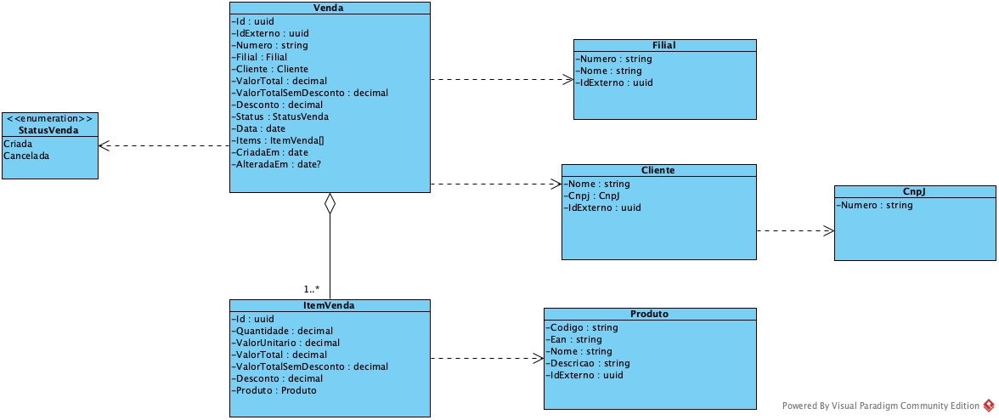
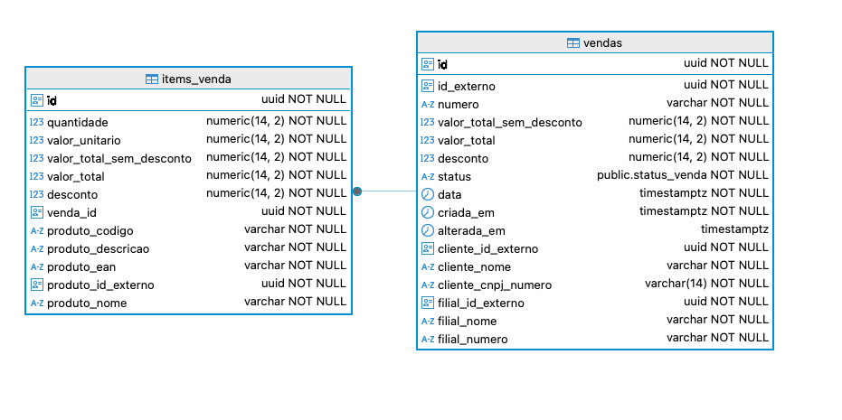

# Vendas API

API de vendas desenvolvida em dotnet core 9.0.

## Tecnologias utilizadas

- .NET Core 9.0 (Minimal API)
- Microsoft AspNetCore OpenApi
- Stoplight Elements
- SonarAnalyzer CSharp
- Entity Framework Core
- MediatR
- OneOf
- FluentValidation
- Serilog
- XUnit
- FluentAssertions
- Bogus
- NSubstitute
- MockQueryable NSubstitute
- TestContainers Postgres
- Coverlet Collector
- Microsoft.AspNetCore.Mvc.Testing
- Postgres
- Docker

## Executando a aplicação

Para executar a aplicação, é necessário ter o SDK .NET 9.0 instalado, além do banco de dados Postgres instalado ou executando em um container Docker. Com ambos instalado, execute o comando abaixo:

```bash
dotnet run --project src/Vendas.Api/Vendas.Api.csproj
```

A aplicação estará disponível em `http://localhost:5050`. A documentação da API estará disponível em `http://localhost:5050/docs`.

Se necessário modifique a string de conexão com o banco de dados no arquivo [`appsettings.Development.json`](./src/Vendas.Api/appsettings.Development.json).

## Executando os testes

Para executar os testes, execute o comando abaixo:

```bash
dotnet test
```

## Cobertura de testes

Para gerar a cobertura de testes, execute o comando abaixo:

```bash
sh ./tests/Vendas.Tests/run-coverage-report.sh
```

A cobertura de testes estará disponível em `./tests/Vendas.Tests/TestResults/report/index.html`.

## Executando a aplicação com Docker

Para executar a aplicação com Docker, execute o comando abaixo:

### Linux

```bash
docker compose up
```
ou
```bash
sh ./up.sh
```

### MacOS Apple silicon (arm64)

```bash 
docker compose -f compose.yaml -f compose.arm64.yaml up
```
ou
```bash
sh ./up.arm64.sh
```

A aplicação estará disponível em `http://localhost:5050`. A documentação da API estará disponível em `http://localhost:5050/docs`.

## Modelagem domínio



## Modelagem banco de dados




